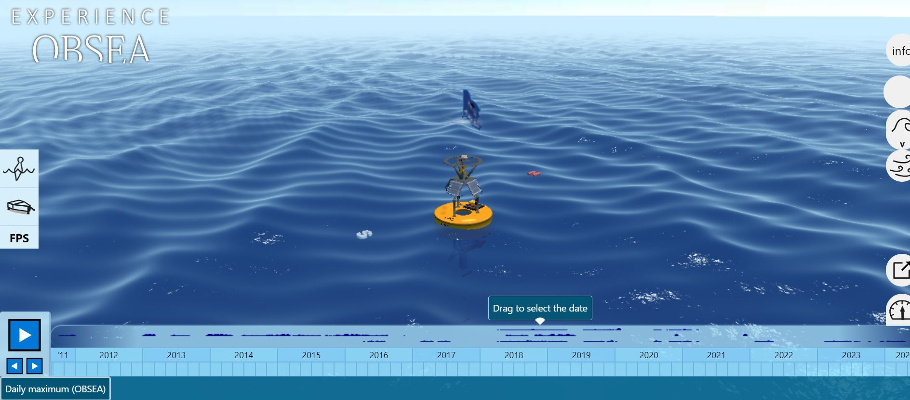
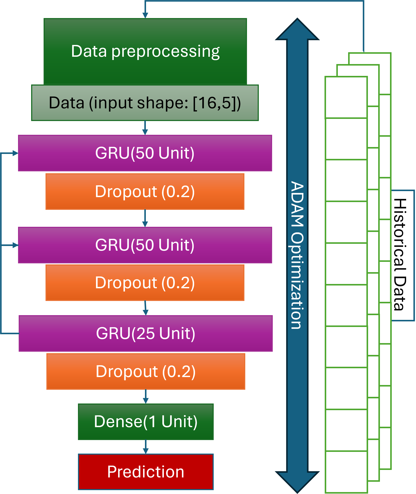
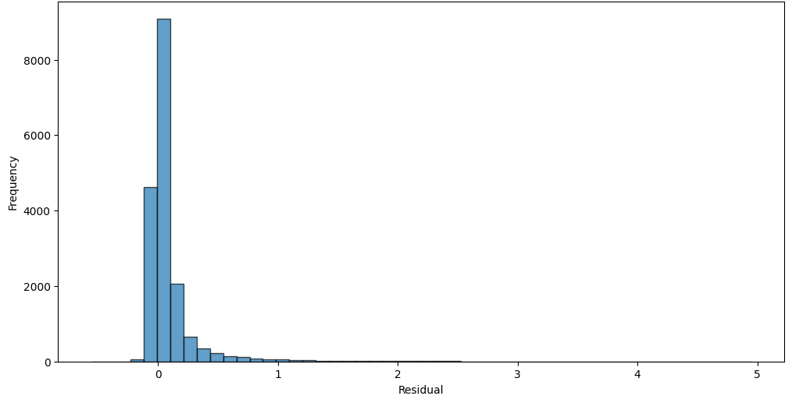
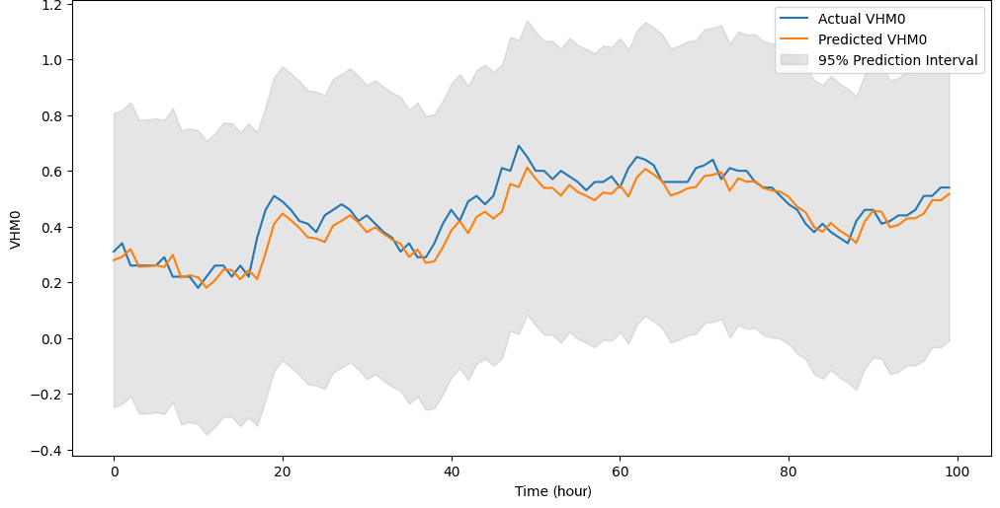
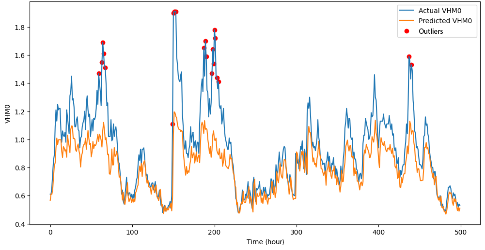
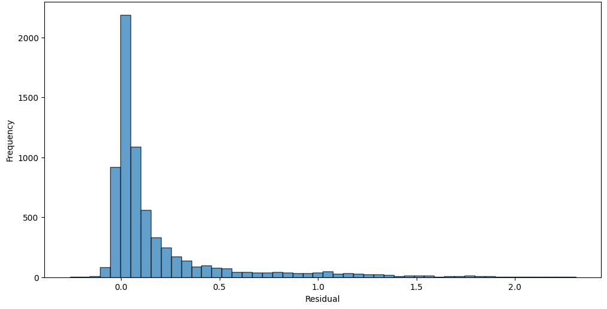
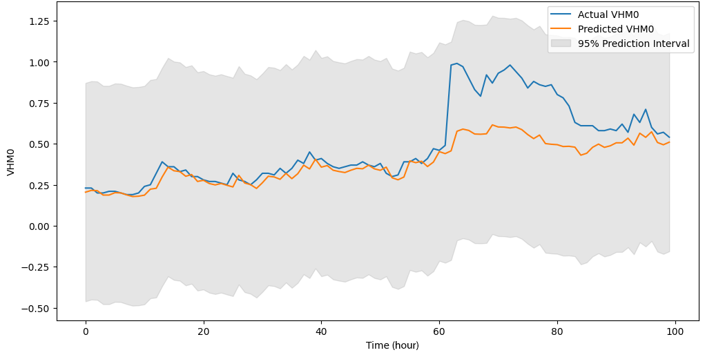
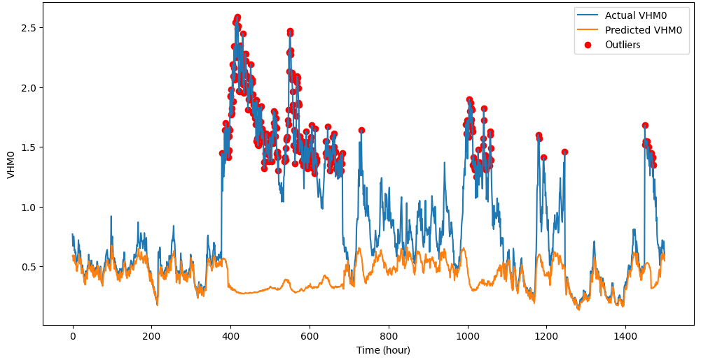

# Significant Wave Height Modeling for Marine Digital Twins

[](https://www.python.org/)
[](LICENSE)
[](https://doi.org/10.1109/MetroSea62823.2024.10765714)

An inference-ready Gated Recurrent Unit (GRU) model for one-step-ahead forecasting of significant wave height (VHM0/Hs) from buoy and underwater-observatory measurements. The repository packages the pretrained model, its preprocessing artifacts, a small sample dataset, and a reproducible prediction interface suitable for marine monitoring and digital-twin prototypes.

> This repository contains the trained artifacts used for inference. It intentionally does not retrain the model.

## Why this project matters

Significant wave height is a practical indicator of sea-state severity and is used in maritime safety, offshore operations, coastal engineering, and environmental monitoring. This project turns sequential observations into a compact prediction service that can be integrated into a larger marine digital twin.

The approach uses a 16-step look-back window and four wave features:

| Feature | Meaning | Unit |
| --- | --- | --- |
| `VDMR` / `VMDR` | Mean wave direction | degree |
| `VTPK` | Peak wave period | s |
| `VZMX` | Maximum wave height | m |
| `VTZA` | Zero-crossing wave period | s |

The model predicts the next `VHM0` value in metres. The saved scaler uses the historical `VDMR` spelling; the inference code also accepts the data-source spelling `VMDR`.

## Reported results

The associated publication evaluates the GRU model on Tarragona, Barcelona, and EMSO-OBSEA datasets. The reported Pearson correlations are 0.9354, 0.9517, and 0.8857, respectively. These numbers are reproduced here as publication results; the repository does not silently recompute or claim new benchmark results.

| Evaluation dataset | MAE (m) | MSE (m²) | RMSE (m) | Pearson *r* | Outliers |
| --- | ---: | ---: | ---: | ---: | ---: |
| Tarragona | 0.0955 | 0.0431 | 0.208 | 0.9354 | 0.24% |
| Barcelona | 0.0903 | 0.0330 | 0.182 | 0.9517 | 2.04% |
| EMSO-OBSEA | 0.1290 | 0.0633 | 0.252 | 0.8857 | 4.11% |

## Paper figures

The following figures were extracted directly from the provided PDF of the associated paper and are stored locally in `docs/figures/`, so they render on the repository landing page without relying on an external image host. Copyright in the figures remains with the publisher/rightsholder; the MIT license in this repository applies to the project code and repository materials authored for this release, not to the IEEE figures.

### Digital-twin context



*Figure 1 from the paper. [Official article page](https://ieeexplore.ieee.org/document/10765714).*

### Model architecture



*Figure 2 from the paper: three GRU layers, dropout, and a dense output layer. [Official article page](https://ieeexplore.ieee.org/document/10765714).*

### Barcelona evaluation



*Figure 3 from the paper: residual distribution for the Barcelona dataset.*



*Figure 4 from the paper: actual and predicted VHM0 with 95% prediction intervals.*



*Figure 5 from the paper: actual and predicted VHM0 with flagged outliers.*

### EMSO-OBSEA evaluation



*Figure 6 from the paper: residual distribution for the EMSO-OBSEA dataset.*



*Figure 7 from the paper: actual and predicted VHM0 with 95% prediction intervals.*



*Figure 8 from the paper: actual and predicted VHM0 with flagged outliers.*

The complete figure index, extraction note, and official article link are documented in [`docs/figures/README.md`](docs/figures/README.md).
## Repository layout

```text
.
├── data/
│   ├── sample/                 # Small, tracked example input
│   └── README.md               # Data provenance and field notes
├── docs/figures/               # Paper figure references and captions
├── models/                     # Pretrained GRU and fitted scalers
├── scripts/                    # Small command-line helpers
├── src/obsea_swh/              # Reusable inference package
├── tests/                      # Lightweight validation tests
├── CITATION.cff
├── LICENSE
├── pyproject.toml
└── requirements.txt
```

Large raw exports, duplicate downloads, notebooks with machine-specific outputs, and compressed archives are intentionally excluded from version control. The original working copies can remain locally under `Obsea_bouy_data/` and `Trained_model_SWH/`.

## Quick start

### 1. Create an environment

```bash
python -m venv .venv
# Windows PowerShell
.\.venv\Scripts\Activate.ps1
# macOS/Linux
# source .venv/bin/activate
pip install -e ".[test]"
```

If you only need the dependency list, `pip install -r requirements.txt` is also supported; install the package itself with `pip install -e .` before using the module command.

TensorFlow is only required when running predictions. The saved model was created with TensorFlow/Keras; using a compatible TensorFlow release is recommended for production deployment.

### 2. Run a prediction from the included sample data

```bash
python -m obsea_swh.inference \
  --input data/sample/obsea_wave_observations.csv \
  --model-dir models \
  --look-back 16
```

On Windows PowerShell, use one line or replace the backslash with the PowerShell continuation character `` ` ``.

The command reads the latest valid 16 rows, applies the persisted feature and target scalers, loads the pretrained GRU, and prints the next VHM0 estimate in metres.

### 3. Use the Python API

```python
from obsea_swh.inference import predict_from_csv

prediction_m = predict_from_csv(
    "data/sample/obsea_wave_observations.csv",
    model_dir="models",
    look_back=16,
)
print(f"Predicted next significant wave height: {prediction_m:.3f} m")
```

For an array-based interface, pass a numeric array with shape `(16, 4)` to `predict_next`. Columns must be ordered as `VDMR`, `VTPK`, `VZMX`, `VTZA`.

## Reproducibility and engineering notes

- The inference path is deterministic for a fixed TensorFlow runtime and input window.
- Preprocessing is not refit at inference time; the original fitted scalers are loaded from `models/`.
- Input validation rejects missing values, non-finite values, incorrect window sizes, and incorrect feature counts before model execution.
- The model artifact is kept separate from application code so it can be replaced by a versioned deployment artifact later.
- No training script is included in this release. The repository is designed to make the published model usable and inspectable without accidentally starting a costly training run.

## Data and provenance

The sample file is a trimmed project copy of OBSEA wave observations. The paper evaluates datasets from Tarragona, Barcelona, and EMSO-OBSEA. Please consult the data-provider terms before redistributing larger raw exports; see [`data/README.md`](data/README.md).

## Publication

Neyestani, A., Toma, D. M., Falahzadeh, A., Daponte, P., del Río Fernández, J., and De Vito, L. “A Significant Wave Height Data-Driven Modeling for Digital Twins of Marine Environment.” *2024 IEEE International Workshop on Metrology for the Sea (MetroSea)*, Portorož, Slovenia, 2024, pp. 495–500. DOI: [10.1109/MetroSea62823.2024.10765714](https://doi.org/10.1109/MetroSea62823.2024.10765714). [IEEE Xplore](https://ieeexplore.ieee.org/document/10765714)

## License

The project code and repository materials are released under the MIT License. See [`LICENSE`](LICENSE). Third-party data and IEEE-hosted paper figures remain subject to their original terms.
